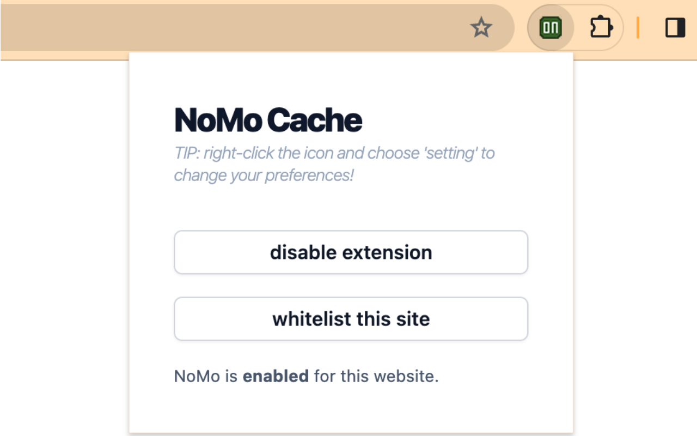

# NoMo Cache
Chrome extension that disables cache for all websites with website whitelist support.

> This popup will be shown when clicking the extension icon

# Features
- Disable all cache
- Whitelist websites to keep their cache
- Light/ Dark mode for popup and settings

# More screenshots

> Settings page

> The popup, but in dark mode

> The settings page, but in dark mode
